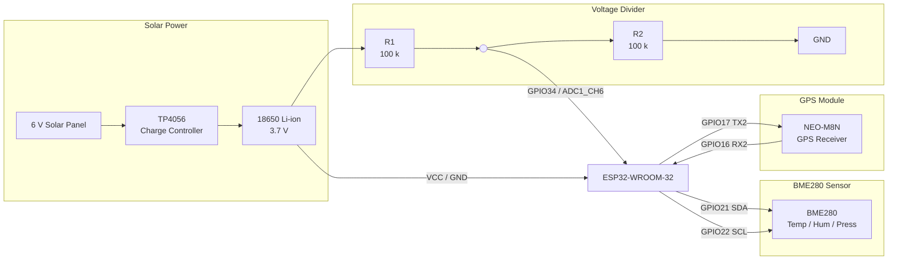
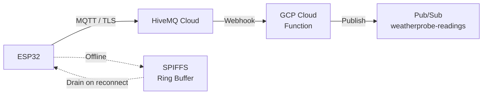

# WeatherProbe

Solar-powered ESP32 weather station that collects temperature, humidity,
pressure, and GPS location every 5 minutes and publishes to GCP Pub/Sub
via MQTT over TLS.

## Hardware

| Component | Part | Interface |
|-----------|------|-----------|
| MCU | ESP32-WROOM-32 DevKit | -- |
| Environment sensor | BME280 | I2C (addr 0x76) |
| GPS receiver | NEO-M8N | UART @ 9600 baud |
| Battery | 18650 Li-ion 3.7 V | ADC via voltage divider |
| Solar panel | 6 V panel | TP4056 charge controller |

## Wiring Diagram



## Data Path



## Wake Cycle

Every 5 minutes the firmware:

1. Reads BME280 (temperature, humidity, pressure) over I2C
2. Reads GPS (latitude, longitude, altitude) over UART -- 30 s timeout,
   falls back to last-known position stored in RTC memory
3. Reads battery voltage via ADC (16-sample average)
4. Connects WiFi, synchronises time via SNTP
5. Publishes a JSON reading to HiveMQ via MQTT/TLS (QoS 1)
6. Drains up to 10 buffered readings from SPIFFS
7. If publish fails, stores the reading in the SPIFFS ring buffer
8. Enters deep sleep

## JSON Payload

```json
{
  "device_id": "weatherprobe-01",
  "ts": 1709380800,
  "temp_c": 22.5,
  "humidity_pct": 45.2,
  "pressure_hpa": 1013.25,
  "lat": 60.1699,
  "lon": 24.9384,
  "alt_m": 15.3,
  "battery_pct": 78,
  "battery_v": 3.82,
  "gps_fix": true
}
```

## Project Structure

```
ard_weatherprobe/
├── CMakeLists.txt          Project-level CMake
├── Makefile                Convenience wrapper for idf.py
├── sdkconfig.defaults      ESP-IDF Kconfig defaults
├── partitions.csv          Custom partition table (NVS + SPIFFS)
├── provision.sh            Interactive credential provisioning
├── main/
│   ├── CMakeLists.txt      Component source list
│   ├── main.c              Entry point and wake-cycle orchestration
│   ├── config.h            Pin assignments, timing, buffer limits
│   ├── sensor_bme280.c/h   BME280 I2C driver with Bosch compensation
│   ├── sensor_gps.c/h      NEO-M8N UART NMEA GGA parser
│   ├── battery.c/h         ADC battery voltage monitor
│   ├── data_buffer.c/h     SPIFFS FIFO ring buffer
│   ├── credentials.c/h     NVS credential loader
│   └── wp_mqtt.c/h         WiFi STA + MQTT/TLS client
└── cloud/
    ├── cloud_function/
    │   ├── main.py         GCP Cloud Function (MQTT webhook -> Pub/Sub)
    │   └── requirements.txt
    └── pubsub_setup.sh     Create Pub/Sub topic and subscription
```

## Build

Requires the [ESP-IDF](https://docs.espressif.com/projects/esp-idf/en/stable/esp32/get-started/)
toolchain (v5.x).

```sh
# Build
make build

# Flash and monitor (most common)
make fm

# Override serial port
make flash PORT=/dev/ttyACM0

# Provision WiFi and MQTT credentials to NVS
make provision

# Other targets: clean, fullclean, menuconfig, size, erase
```

Or use `idf.py` directly:

```sh
idf.py build
idf.py -p /dev/ttyUSB0 flash monitor
```

## Provisioning

Before first use, flash WiFi and MQTT credentials into the NVS partition:

```sh
./provision.sh
```

The script prompts for WiFi SSID/password and MQTT broker details, then
writes them to the ESP32's NVS flash.  Credentials never appear in source
code.

## Cloud Setup

1. Create the Pub/Sub topic and subscription:
   ```sh
   cd cloud && bash pubsub_setup.sh
   ```
2. Deploy the Cloud Function:
   ```sh
   cd cloud/cloud_function
   gcloud functions deploy weatherprobe-bridge \
       --runtime python312 \
       --trigger-http \
       --entry-point webhook \
       --set-env-vars GCP_PROJECT=<project>,WEBHOOK_SECRET=<secret>
   ```
3. Configure HiveMQ Cloud to forward messages to the Cloud Function URL.

## License

MIT
